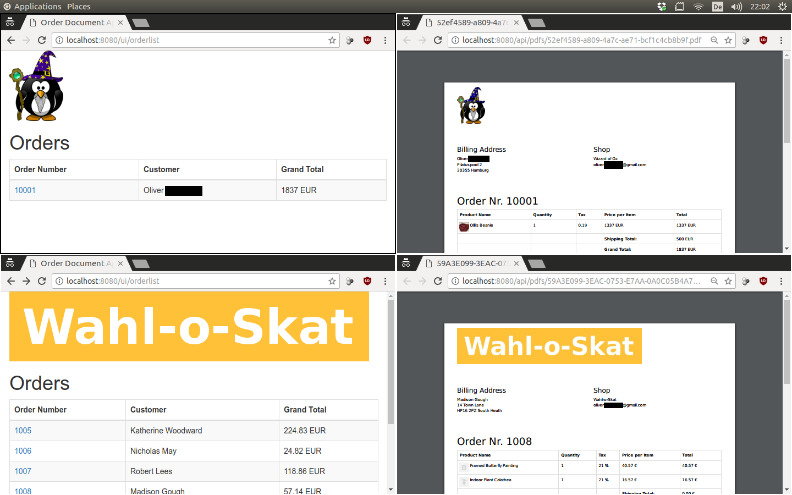

# Beautiful Order Documents [](https://hub.docker.com/r/oozz/beautiful-order-documents/)

This app shows a list of orders for a configured shop.
Each order has a link, that triggers rendering the order invoice as a PDF.

## Screenshot



Explaination:

* **left**: list of orders
* **right**: PDF that is generated when an order from the list is clicked
* **top**: using ePages Now&Beyond REST API
* **bottom**: using ePages Base/Now REST API

## Running it

The Makefile does most of the heavy lifting for you:

```
# 0. Build the image
make docker_build

# 1. Create docker environments from the templates
make docker_init_env

# 2. Edit env.list or/and env-beyond.list to match your app's credentials
#    using an editor of your choice

# 3a. To run the ePages Base/Now version:
make docker_run

# 3b. To run the ePages Now&Beyond version:
make docker_run_beyond
```
